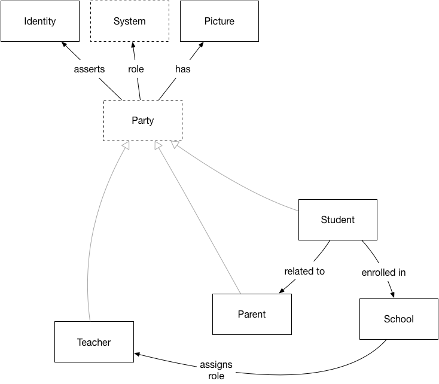
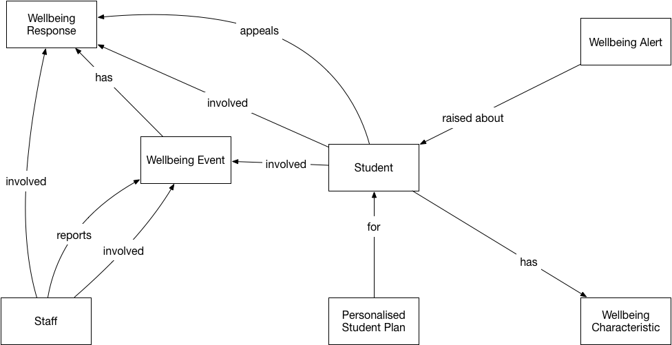

**SIF AU Conceptual Data Model, NSIP**

v.0.3, 2018-04-09

[linda.marshall@nsip.edu.au](mailto:linda.marshall@nsip.edu.au) [nick.nicholas@nsip.edu.au](mailto:nick.nicholas@nsip.edu.au)

This document proposes a conceptual model underlying the SIF-AU 3.4.3 data model. The conceptual model is at the level of entities and relations between them; attributes are not listed. All objects in the Australian data model are represented; some objects are represented as relations between entities, rather than as distinct entities.

For clarity, the conceptual model is broken up into use cases:

- [Enrolment](#enrolment)
- [Provisioning](#provisioning)
- [Timetable/Attendance](#timetableattendance)
- [Finance/Resources](#financeresources)
- [NAPLAN](#naplan)
- [Wellbeing](wellbeing)
- [Classroom Assessment](#classroomassessment)
- [Scheduling](#scheduling)
- [Statistics](#statistics)
- [Teaching & Learning](#teachinglearning)

Entities are named with names that the schools sector business can relate to readily, rather than the current names of SIF-AU objects. A list mapping the conceptual model names to SIF objects follows.

# Enrolment

The following are the primary objects involved in enrolling a student onto school systems.

  

The following includes secondary objects which may also be invoked during student enrolment (shaded grey).

  

# Provisioning

The grey arrows point to superclasses; e.g. Party is a superclass of Teacher, Parent, and Student. The dotted entity Party is not represented separately in the SIF-AU data model; a common type contains Personal information.

  

# Timetable/Attendance

  
  
  

# Finance/Resources

The grey arrows point to superclasses; e.g. Debtor is a superclass of Vendor. The dotted entities, Invoicee and Transaction, are not represented separately in the SIF-AU data model; they are realised through a choice of links to their subclass objects.

  

# NAPLAN

  

# Wellbeing

The entities in the Wellbeing Usecase are densely interrelated; an Individualised Plan, for example, can draw on all of Behaviour Events, Alerts, and Wellbeing Characteristics. The relations indicated here are not an exhaustive list, and some relations have been left out for clarity.

  

# Classroom Assessment

  

# Scheduling

The grey arrows point to superclasses; e.g. Resource is a superclass of Room and Learning Resource. The dotted entity Resource is not represented separately in the SIF-AU data model; it is realised through a choice of links to their subclass objects.

  

# Statistics

The greyed out objects are of secondary importance to the specification, and have been little used to date.

  

# Teaching & Learning

The greyed out objects are of secondary importance to the specification, and have been little used to date.

  

# Mappings of Conceptual Model to SIF data model

## Entities

Relations which map to SIF objects are given in lowercase and italicised.

| **Conceptual** | **SIF-AU** |
| --- | --- |
| School | SchoolInfo |
| Student | StudentPersonal |
| _enrolls_ | StudentSchoolEnrolment |
| Teacher | StaffPersonal |
| _assigns role_ | StaffAssignment |
| Parent/Student Contact | StudentPersonalContact |
| _relationship with_ | StudentPersonalRelationship |
| Class | TeachingGroup; SectionInfo |
| Calendar | CalendarSummary |
| Day | CalendarDate |
| Course | SchoolCourseInfo [relations coded redundantly with Class] |
| Subject | TimeTableSubject |
| Education Authority | LEAInfo |
| Term | TermInfo |
| Period | TimeTableCell |
| Room | RoomInfo |
| TimeTable | TimeTable |
| Scheduled Activity | ScheduledActivity |
| _attendance marked for_ | Period: StudentPeriodAttendance; Calendar Day: StudentDailyAttendance, StudentAttendanceTimeList; reporting object: StudentAttendanceSummary |
| Program | SchoolPrograms |
| _participates_ | Program: StudentParticipation; Co-Curricular Activity: StudentActivityParticipation |
| Identity | Identity |
| _role_ | SystemRole |
| Picture | PersonPicture |
| Co-Curricular Activity | StudentActivityInfo |
| Learning Activity | Activity |
| Learning Standard | LearningStandardItem |
| Curriculum | LearningStandardDocument |
| Learning Resource | LearningResource |
| Learning Resource Package | Learning Resource Package |
| Equipment | EquipmentInfo |
| Resource Usage | ResourceUsage |
| Statistical Measurement | AggregateStatisticInfo |
| Statistical Value | AggregateStatisticFact |
| Statistical Characteristic | AggregateCharacteristic |
| Vendor | VendorInfo |
| Purchase Order | PurchaseOrder |
| Charged Location | ChargedLocation |
| Debtor | Debtor |
| Account | FinancialAccount |
| Journal | Journal |
| Invoice | Invoice |
| Receipt | PaymentReceipt |
| NAP Test | NAPTest |
| _registers for_ | NAPEventStudentLink |
| NAP Testlet | NAPTestlet |
| NAP Item | NAPTestItem |
| NAP Results | NAPStudentResponseSet, reporting object: NAPTestScoreSummary |
| NAP Codeframe | NAPCodeFrame |
| Wellbeing Event | WellbeingEvent |
| Wellbeing Response | WellbeingResponse |
| _appeals_ | WellbeingAppeal |
| Wellbeing Alert | WellbeingAlert |
| Wellbeing Characteristic | WellbeingCharacteristic |
| Personalised Student Plan | PersonalisedPlan |
| Grading Assignment | GradingAssignment |
| Assignment Score | GradingAssignmentScore |
| Marking Value | MarkValueInfo |
| Grade | StudentGrade |

## Relations

The following maps the relations captured in the conceptual model to sets of SIF-AU objects.

| **Conceptual** | **SIF-AU** |
| --- | --- |
| A Student is enrolled in a School | StudentPersonal, StudentSchoolEnrolment, SchoolInfo |
| A Teacher is assigned a role in a School | StaffPersonal, StaffAssignment, SchoolInfo |
| A Parent/Student Contact has a relationship with a Student | StudentContactPersonal, StudentContactRelationship, StudentPersonal |
| A Student is a member of a Class | StudentPersonal, TeachingGroup;StudentPersonal, StudentSectionEnrollment, SectionInfo |
| A Teacher teaches/associates with a Class | StaffPersonal, TeachingGroup |
| A Class delivers a Course | TeachingGroup, SchoolCourseInfo;SectionInfo, SchoolCourseInfo |
| A Subject is taught within a Class | TeachingGroup, TimeTableSubject |
| (A Class occurs during a Term) | SectionInfo, TermInfo |
| A Class is taught in a Room | TeachingGroup, RoomInfo |
| A Class is taught during a Period | TeachingGroup, TimeTableCell |
| A School has a Calendar | SchoolInfo, CalendarSummary |
| A Day belongs to a Calendar | CalendarDate, CalendarSummary |
| A Course is taught within a School | SchoolCourseInfo, SchoolInfo |
| A Course is taught during a Term | SchoolCourseInfo, TermInfo |
| A Subject is part of a Course | TimeTableSubject, SchoolCourseInfo |
| A Subject is taught within a School | TimeTableSubject, SchoolInfo |
| A Term is administered by a School | TermInfo, SchoolInfo |
| A Timetable is administered by a School | TimeTable, SchoolInfo |
| A Period belongs to a Timetable | TimeTableCell, TimeTable |
| A Scheduled Activity is scheduled for a Period | ScheduledActivity, TimeTableCell, (SessionInfo) |
| A Student attends a Scheduled Activity | ScheduledActivity, StudentPersonal |
| A Teacher attends a Scheduled Activity | ScheduledActivity, StaffPersonal |
| A Class attends a Scheduled Activity | ScheduledActivity, TeachingGroup |
| A Student has attendance marked for a Period | StudentPersonal, StudentPeriodAttendance, (TimeTablePeriod = TimeTableCell) |
| A Student has attendance marked for a Day | StudentPersonal, StudentDailyAttendance, (Date = CalendarDate); StudentPersonal, StudentAttendanceTimeList, (Date = CalendarDate) |
| A Student is graded on a piece of Curriculum | Forthcoming with ICON update |
| A Student participates in a Co-Curricular Activity | StudentPersonal, StudentActivityParticipation, StudentActivityInfo |
| A School belongs to an Education Authority | SchoolInfo, LEAInfo |
| A School offers a Program | SchoolInfo, SchoolPrograms |
| A Student participates in a Program | StudentPersonal, StudentParticipation, SchoolPrograms |
| A Student is a Party | StudentPersonal |
| A Teacher is a Party | StaffPersonal |
| A Parent is a Party | StudentContactPersonal |
| A Party has a Picture | (Party), PersonPicture |
| A Party asserts an Identity | (Party), identity |
| A Party has a role on a System | (Party), SystemRole, (System) |
| A Learning Activity is assigned to a Student | Activity, StudentPersonal |
| A Learning Activity is aligned to a Learning Standard | Activity, LearningStandardItem |
| A Learning Resource is aligned to a Learning Standard | LearningResource, LearningStandardItem |
| A Learning Resource is packaged in a Learning Resource Package | LearningResource, LearningResourcePackage |
| A Learning Standard is part of a Curriculum | LearningStandardItem, LearningStandardDocument |
| A Learning Resource supports a Learning Activity | Activity, LearningResource |
| A Room is a Resource | RoomInfo |
| An Equipment is a Resource | EquipmentInfo |
| A Learning Resource is a Resource | LearningResource |
| A Resource may be booked for a Period | (Resource), ResourceBooking, (Period) |
| A Resource may be booked for a Scheduled Activity | (Resource), ResourceBooking, ScheduledActivity |
| A Resource is booked by a Teacher | Resource), ResourceBooking, StaffPersonal |
| An Assignment is assigned within a Class | GradingAssignment, TeachingGroup |
| A Student is graded against an Assignment | StudentPersonal, GradingAssignmentScore, GradingAssignment |
| A Person engages in Resource Usage | (Person), Resource Usage |
| A School pays for Resource Usage | SchoolInfo, Resource Usage |
| A Statistical Measurement has a Statistical Value | AggregateStatisticalFact, AggregateStatisticalInfo |
| A Statistical Value has a Statistical Characteristic | AggregateStatisticalInfo, AggregateCharacteristicInfo |
| A Teacher (Staff) raises a Purchase Order | StaffPersonal, PurchaseOrder |
| A Purchase Order is raised against a Vendor | PurchaseOrder, VendorInfo |
| A Purchase Order is raised for a Charged Location | PurchaseOrder, ChargedLocationInfo |
| A School is a Charged Location | SchoolInfo, ChargedLocationInfo |
| A Party is a Debtor | (Party), Debtor |
| A Vendor is a Debtor | VendorInfo, Debtor |
| A Charged Location has an Account | ChargedLocationInfo, FinancialAccount |
| An Invoice is a Transaction | Invoice |
| A Receipt is a Transaction | PaymentReceipt |
| A Purchase Order is a Transaction | PurchaseOrder |
| A Journal processes a Transaction | Journal, Transaction |
| A Journal debits/credits an Account | Journal,FinancialAccount |
| A Debtor is an Invoicee | Debtor |
| A Purchase Order is an Invoicee | Debtor |
| An Invoice invoices an Invoicee | Invoice, (Invoicee) |
| An Invoice is invoiced against an Account | Invoice, FinancialAccount |
| An Invoice is invoiced for a Purchase Order | Invoice, PurchaseOrder |
| A Receipt is issued for an Invoice | Invoice, PaymentReceipt |
| A Purchase Order is for Equipment | PurchaseOrder, EquipmentInfo |
| A Student registers for a NAP Test | StudentPersonal, NAPStudentEventLink, NAPTest |
| A School administers a NAP Test | StudentPersonal, (SchoolInfo), NAPStudentEventLink, NAPTest |
| A NAP Testlet is part of a NAP Test | NAPTestlet, NAPTest |
| A NAP Item is part of a NAP Testlet | NAPTestItem, NAPTestlet |
| A NAP Codeframe releases NAP Tests | NAPCodeFrame, NAPTest |
| A NAP Codeframe releases NAP Testlets | NAPCodeFrame, NAPTestlet |
| A NAP Codeframe releases NAP Test items | NAPCodeFrame, NAPTestItem |
| A Student achieves a NAP Result | StudentPersonal, NAPStudentResponseSet; NAPTestScoreSummary |
| NAP Results are graded against a NAP Test | NAPStudentResponseSet, NAPTest; NAPTestScoreSummary |
| A Student is involved in a Wellbeing Event | StudentPersonal, WellbeingEvent |
| A Teacher can be involved in a Wellbeing Event | StaffPersonal, WellbeingEvent |
| A Teacher (Staff) reports a Wellbeing Event | StaffPersonal, WellbeingEvent |
| A Wellbeing Event has a Wellbeing Response | WellbeingEvent, WellbeingResponse |
| A Student is involved in a Wellbeing Response | StudentPersonal, WellbeingResponse |
| A Teacher can be involved in a Wellbeing Response | StaffPersonal, WellbeingResponse |
| A Wellbeing Response is appealed by a Student | WellbeingResponse, WellbeingAppeal, StudentPersonal |
| A Wellbeing Alert is raised about a Student | WellbeingAlert, StudentPersonal |
| A Student has a Wellbeing Characteristic | StudentPersonal, WellbeingCharacteristic |
| An Individualised Plan is for a Student | PersonalisedPlan, StudentPersonal |
| An Individualised Plan responds to a Wellbeing Characteristic | WellbeingChracteristic, PersonalisedPlan |
| An Individualised Plan responds to a Behaviour Event | WellbeingEvent, PersonalisedPlan |
| A Grading Assignment is assigned to a Class | GradingAssignment, TeachingGroup |
| A Grading Assigment is assigned to a Student | GradingAssignment, StudentPersonal |
| A Grading Assignment receives an Assignment Score | GradingAssignmentScore, GradingAssignment |
| An Assignment Score is achieved by a Student | GradingAssignmentScore, StudentPersonal |
| An Assignment Score is scaled to a Marking Value | GradingAssignmentScore, MarkValueInfo |
| A Teacher marks an Assignment Score | GradingAssignmentScore, StaffPersonal |
| A Grading Assignment assesses performance against a Learning Standard | GradingAssignment, LearningStandardItem |
| A Student receives a Grade in a Class | StudentGrade, StudentPersonal, TeachingGroup |
| A Teacher marks a Grade | StudentGrade, StaffPersonal |
| A Grade covers a Term | StudentGrade, TermInfo |
| A Grade assesses performance against a Learning Standard | StudentGrade, LearningStandardItem |
| A Grade is scaled to a Marking Value | StudentGrade, MarkValueInfo |
| A Grade encompasses Assignment Scores | StudentGrade, GradingAssignmentScore |
